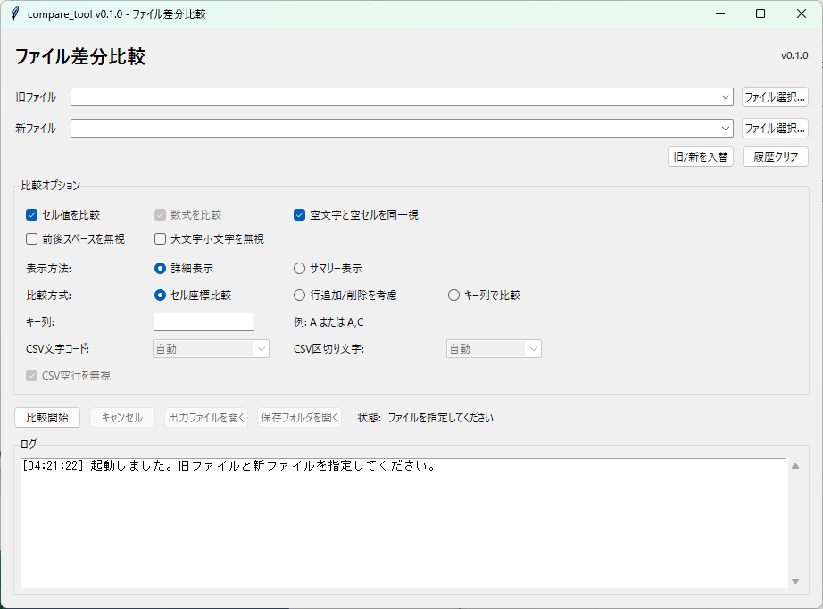

# compare_tool

2つの `.xlsx` または `.csv` ファイルを比較し、比較結果をExcelファイルとして出力するGUIツールです。元ファイルは変更しません。



## セットアップと起動

Python 3.10以降で次を実行してください。

```powershell
python -m venv .venv
.venv\Scripts\Activate.ps1
python -m pip install -e ".[test]"
compare-tool
```

または `python -m compare_tool` でも起動できます。

## 機能

- Excelのセル値、保存済み数式文字列、シート追加・削除の比較
- CSVのセル座標形式での比較
- CSVの文字コード・区切り文字指定
- CSV空行の無視オプション
- セル座標比較、行追加/削除を考慮した比較、キー列指定比較
- 行追加、行削除の検出
- 空文字、空白、大文字小文字の正規化オプション
- 詳細一覧またはサマリーのみの結果シート
- 変更セルを黄色、追加セルを緑で表示
- 詳細一覧から変更・追加セルへの内部リンク
- ファイル選択およびドラッグ＆ドロップ
- 旧/新ファイルの入れ替え、ファイル履歴クリア
- 比較中キャンセル
- 比較完了後の出力ファイル/保存フォルダオープン

数式の再計算は行いません。「セル値を比較」はファイル内に保存済みの計算結果を使用します。Excelで未計算の数式は、数式比較をONにして確認してください。

CSV比較では、CSVを `CSV` という1シートの表として扱い、結果は `.xlsx` で出力します。CSVの文字コードと区切り文字は画面から指定できます。

CSV比較の出力では、比較結果シートの右側に読み込み時の文字コード、区切り文字、空行の扱いを記録します。

CSV文字コード:

- 自動
- UTF-8 / UTF-8 BOM
- Shift_JIS

`自動` はBOMを確認し、BOMがない場合はUTF-8、Shift_JISの順に読み取りを試します。

CSV区切り文字:

- 自動
- カンマ
- タブ
- セミコロン

`自動` は先頭行をカンマ、タブ、セミコロンで読み比べ、列数が多く安定している区切り文字を選びます。

CSV空行は既定で無視します。空行自体を差分として確認したい場合は `CSV空行を無視` をOFFにしてください。

## 比較方式

### セル座標比較

同じシート名、同じセル座標の値または数式を比較します。もっとも単純で高速な方式です。

行追加や行削除がある場合は、後続行が大量の変更として検出されることがあります。

### 行追加/削除を考慮

行全体の内容から同じ行をLCSで対応付け、対応できなかった行を `行追加` / `行削除` として検出します。

行全体が同じ場合に強く、単純な行挿入や行削除で後続行が大量変更になるのを抑えられます。一方で、行内の一部セルが変わった行は同じ行として対応できない場合があります。

### キー列で比較

指定した列の値をキーとして行を対応付けます。行の並び替えや移動があっても、同じキーの行として比較できます。

キー列は `A` または `A,C` のように列名だけを指定します。`A1` のようなセル座標は指定できません。キー値が重複している場合は、誤対応を避けるため比較を停止します。

## 設計

`Comparer` が形式非依存の比較戦略、`Difference` / `CompareResult` が共通結果モデルです。Excel固有処理は `ExcelReader`、`ExcelComparer`、`ExcelReportWriter`、CSV固有処理は `CsvReader`、`CsvComparer`、`CsvReportWriter` に分離しています。将来は同じインターフェースでJSON・XML用の実装を追加できます。GUIは `CompareUseCase` のみを呼び出します。

入力Excelは `WorkbookPreparer` を通してから比較します。現在 `.xlsx` はそのまま比較し、`.xls` は変換層まで受け付けたうえで未実装エラーにします。将来はこの層にExcelまたはLibreOfficeを使った `.xls` → `.xlsx` 変換を追加する想定です。

## テスト

```powershell
python -m pip install -e ".[dev]"
python -m ruff check .
python -m ruff format --check .
python -m mypy
python -m pytest -q
```

手動確認用のExcel/CSVサンプルは次のコマンドで `samples` フォルダに作成できます。

```powershell
python tools\create_sample_files.py
```

同じ品質チェックはGitHub ActionsでもPython 3.10／3.12（Windows）に対して自動実行されます。

大容量・疎なExcelの性能回帰テストは、通常テストと分けて次のコマンドで実行できます。

```powershell
python -m pytest -m performance -q
```

GitHub Actionsでは毎週日曜日3時（日本時間）に実行され、必要なときは手動でも開始できます。

## Windows向け配布

PyInstallerで単体の実行ファイルを作成できます。

```powershell
python -m pip install -e ".[dev]"
python -m PyInstaller compare_tool.spec --noconfirm --clean
```

作成された実行ファイルは `dist\compare_tool.exe` です。配布前には、別フォルダへコピーして起動し、サンプルExcelで比較できることを確認してください。

GitHub Actionsの `Build Windows App` は手動実行、または `v*` タグのpushでWindows実行ファイルをビルドし、`compare_tool-v<version>-windows` artifactとして保存します。

`v*` タグのpush時は、`compare_tool-v<version>-windows.zip` をGitHub ReleaseのAssetsにもアップロードします。zipには `compare_tool.exe`、`README.md`、`LICENSE`、`docs` が含まれます。

リリース前の確認項目は [docs/RELEASE_CHECKLIST.md](docs/RELEASE_CHECKLIST.md) にまとめています。

## 既知の制限

現在、実際に比較できる対象は `.xlsx` 同士、または `.csv` 同士です。`.xls` は変換層の入口だけ用意済みですが、実変換は未実装です。`.xlsm`、JSON、XMLには対応していません。

`.xlsx` と `.csv` のように異なる形式同士の比較には対応していません。

Excelの比較対象はセル値、数式文字列、行追加、行削除、シート追加、シート削除です。書式、コメント、図形、画像、行高、列幅、テーブル定義は比較しません。

CSVの比較対象は各フィールドの文字列です。文字コード、区切り文字、空行の扱いは比較オプションで指定します。

`行追加/削除を考慮` は、行全体が同じ場合の対応付けを目的にした初期版です。行内の一部セルが変わった行の対応付けには、キー列比較を推奨します。

`キー列で比較` は、キー値が空の行を対応付け対象から除外します。キー値が重複している場合は比較を停止します。

数式の再計算は行いません。数式の計算結果はExcelファイル内に保存済みの値を使用します。

## よくあるエラー

- `旧ファイルと新ファイルに同じファイルが指定されています。`: 異なる2つのExcelファイルを指定してください。
- `.xlsx、.xls、.csv のいずれかを指定してください。`: 入力ファイルには対応している拡張子のファイルを指定してください。現時点で実際に比較できるのは `.xlsx` 同士、または `.csv` 同士です。
- `旧ファイルと新ファイルは同じ形式を指定してください。`: `.xlsx` と `.csv` のような異なる形式同士の比較には対応していません。
- `.xls ファイルの変換機能はまだ実装されていません。`: `.xls` の入口は用意済みですが、ExcelまたはLibreOfficeを使った変換処理は今後対応予定です。
- `CSVファイルの文字コードを自動判定できません。`: 対応している自動判定候補はUTF-8 / UTF-8 BOM / Shift_JISです。別の文字コードのCSVはUTF-8またはShift_JISで保存し直してください。
- `CSVファイルを ... として読み取れません。`: CSV文字コードの指定が実際のファイルと異なる可能性があります。`自動` で失敗する場合は `UTF-8 / UTF-8 BOM` または `Shift_JIS` を選び直してください。
- `CSVファイルの形式を読み取れません。`: 引用符や改行を含むフィールドが壊れている可能性があります。Excelなどで開けるか確認し、必要ならCSVとして保存し直してください。
- `CSV区切り文字は1文字で指定してください。`: CSV区切り文字には自動、カンマ、タブ、セミコロンを指定してください。区切り文字が違うと、列が分かれず正しい差分にならないことがあります。
- `Excelファイルが破損しているか、読み取れません。`: Excelで開けるか確認し、必要なら別名保存してから再実行してください。
- `パスワード付きExcelは比較できません。`: パスワードを解除したコピーを指定してください。
- `出力ファイルを保存できません。`: 出力先ファイルをExcelで開いていないか、保存先フォルダへ書き込めるか確認してください。
- `キー列比較ではキー列を指定してください。`: 比較方式に `キー列で比較` を選んだ場合は、キー列に `A` や `A,C` を指定してください。
- `キー列は列名だけを指定してください。`: `A1` ではなく `A` のように列名だけを指定してください。
- `キー列 ... の値が重複しています。`: キー値が重複しているため、どの行同士を比較すべきか決められません。キー列を変更するか、重複を解消してください。
